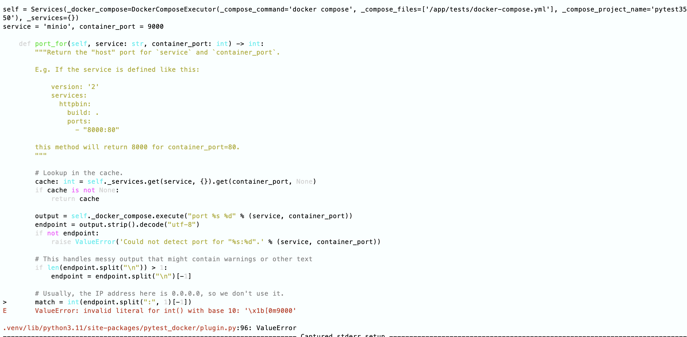

# Replacing docker with podman for python development
# using pytest with pytest-docker


https://www.redhat.com/sysadmin/podman-inside-container
https://www.redhat.com/sysadmin/compose-podman-pods

``` bash
podman run --privileged quay.io/podman/stable podman run ubi8 echo hello
```

```bash
docker run -it quay.io/podman/stable bash
```

## Podman in docker

Interactive shell
```bash
docker run -it --privileged quay.io/podman/stable bash
```

Hello world
```bash
docker run -it --privileged quay.io/podman/stable podman run hello-world
```


## Making tests possible

1. Run podman image
2. Install python + poetry + git
3. Install podman compose https://github.com/containers/podman-compose
4. ln -s podman docker


-> Problem with answers of Podman
